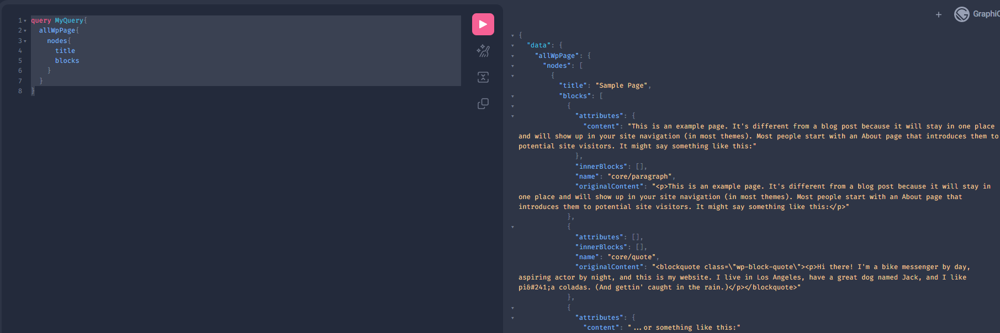

# Gatsby (Wordpress as CMS)

## Getting Started:

**Setup**

> `npx gatsby new the-gatsby-garadge https://github.com/tomphill/gatsby-wordpress-gutenberg-starter`

> **Install the gatsby cli**

> `npm install -g gatsby-cli`

**Running the dev server**

> `gatsby develop`

#### Routes:

- In `/src/pages` any file we create will automatically be a route.
- By default our home page will be `index.js` in `/src/pages`

```js
import * as React from "react";

const IndexPage = () => {
  return (
    <main>
      <h1>Home Page</h1>
    </main>
  );
};

export default IndexPage;

export const Head = () => <title>Home Page</title>;
```

- In our version the h1 will not appear as large text because of the tailwind resets.

- In each of our page components we can export a Head component that will be used to set the title of the page.

```js
export const Head = () => (
  <>
    <meta name="description" content="This is the test page" />
    <title>This is the test Page</title>
  </>
);
```

**Graphql Interface can be found at:**

- [http://localhost:8000/\_\_\_graphql](http://localhost:8000/___graphql)

**Test Query to see we are connected to Wordpress**

```graphql
query MyQuery{
  allWpPage{
    nodes{
      title
      blocks
    }
  }
}
```




---
---

## Creating Pages:

> In the root directory of our project we can create a `gatsby-node.js` file.

- We can export a function that will create pages based on the pages in our Wordpress site.

```js
 exports.createPages = async ({ actions, graphql }) => {
 };
```

**Basic Usage**
>gatsby-node.js
```js
const path = require("path");

exports.createPages = async ({ actions, graphql }) => {
  const pageTemplate = path.resolve(`./src/templates/page.js`);
  const { createPage } = actions;

  const { data } = await graphql(`
    query AllPagesQuery {
      allWpPage {
        nodes {
          blocks
          databaseId
          uri
        }
      }
    }
  `);

  for (let i = 0; i < data.allWpPage.nodes.length; i++) {
    const page = data.allWpPage.nodes[i];
    createPage({
      path: page.uri,
      component: pageTemplate,
    });
  }
};

```

>/templates/page.js
```js
import React from "react";
function page() {
    return (
        <div>
            This is a page template
        </div>
    )
}

export default page
```


#### Render Wordpress Blocks in Gatsby:

```js
import React from "react";
import {
  BlockRendererProvider,
  BlockRenderer,
  getStyles,
  getClasses,
} from "@webdeveducation/wp-block-tools";

function Page(props) {
  console.log(props);

  return (
    <div>
      <BlockRendererProvider
        allBlocks={props.pageContext.blocks}
        renderComponent={(block) => {
          console.log("Render Component:", block);

          switch (block.name) {
            case "core/media-text":
              const content = <BlockRenderer blocks={block.innerBlocks} />;
              return (
                <div
                  key={block.id}
                  className={getClasses(block)}
                  style={getStyles(block)}
                >
                  {block.attributes.mediaPosition === "right" && (
                    <div>{content}</div>
                  )}
                  <div>This will be the image</div>
                  <div>
                    {block.attributes.mediaPosition !== "right" && (
                      <div>{content}</div>
                    )}
                  </div>
                </div>
              );
            default:
              return null;
          }
        }}
      ></BlockRendererProvider>
    </div>
  );
}

export default Page;
```


#### Using Gatsby Image:


